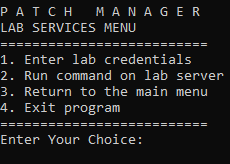

# Patch Manager

## About the project
This project is programmed to decrease the time wasted while finishing up a patch. 
It has two main functions:
1. Printing JIRA issues to a text file
2. Creating a patch file in zitsvy server.

## Prerequisites
* To send a succesful request to JIRA, .env.example should be renamed to .env and fields must be changed
* In order to not receive a empty console error, the program must be run as a jar from the command line

## Usage

### Main Menu

1. Starts the admin txt file creation. It asks the user for the label, version and patch number. Sends a request to JIRA with the entered label and creates a txt file.

2. Goes to zitsvy menu

3. Goes to lab menu

### Zitsvy Menu

1. Required to execute any service, asks for the username, IP and password for the zitsvy server

2. Run basic commands on zitsvy server such as ls, pwd, df -H etc.

3. Do file transfer from this zitsvy server to another server using scp

4. Goes to gitwaeall and takes maven build

5. Creates FC file

6. Creates a patch file

### Lab Menu

1. Required to execute any service, asks for the username, IP and password for the lab server

2. Run basic commands on lab server such as ls, pwd, df -H etc.
